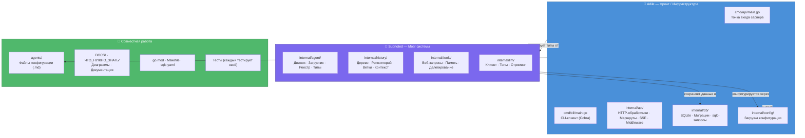

# Разделение работы между разработчиками

## Контекст

Проект **GoPengAI** — это AI-агентная система на Go, которая позволяет:
- Создавать диалоговые сессии с LLM (Large Language Model)
- Сохранять историю с древовидной структурой (ветвление как в git)
- Использовать инструменты (веб-поиск, память, делегирование под-агентам)
- Конфигурировать агентов через Markdown-файлы
- Потоково передавать ответы через SSE (Server-Sent Events)

Проект разрабатывался двумя разработчиками. Разделение логическое — каждый отвечал за свой «слой» системы.

---

## Схема разделения



---

## Кто что делал

### Адиль — Фронт / Инфраструктура (весь проект ≈ 50%)

**Тема:** Инфраструктура, хранение данных и пользовательские интерфейсы.

| Компонент | Что сделано | Почему у Адиля |
|-----------|-------------|----------------|
| **cmd/api/main.go** | Сервер: загружает конфиг → открывает БД → мигрирует → инициализирует sqlc → создаёт LLM-клиент → подключает обработчики → запускает HTTP | Это «входная дверь» приложения |
| **cmd/cli/main.go** | Cobra CLI: `chat` (один запрос + REPL), `session` (list/show/create/delete) | Интерфейс для пользователя |
| **internal/api/handler.go** | HTTP-обработчики: CRUD сессий, отправка сообщений (транзакционно), OpenAI-совместимый проход, обработка ошибок | API — это лицо системы |
| **internal/api/routes.go** | Регистрация маршрутов через Go 1.22+ роутер с поддержкой методов HTTP | Маршрутизация запросов |
| **internal/api/events.go** | EventBus + SSE-стриминг (каркас) | Инфраструктура реального времени |
| **internal/api/middleware.go** | Логирование, CORS, восстановление после паник, аутентификация | Защита и наблюдаемость |
| **internal/db/** | SQLite-соединение (ncruces/go-sqlite3, чистый Go без CGo), Goose-миграции (5 таблиц + триггеры + индексы), sqlc-запросы | Хранение данных |
| **internal/config/config.go** | Структура Config, загрузка JSON, переопределение через env-переменные | Конфигурация |
| **sqlc.yaml** | Конфигурация sqlc-генератора | Инструмент сборки |

**Что Адиль сказал бы на защите:**
> *«Я занимался всей «скучной» инфраструктурой — чтобы данные сохранялись на диск, запросы приходили и уходили, а пользователь мог удобно общаться через CLI или API. Мой код — это то, что вы видите, когда запускаете программу.»*

---

### Subnoted — Мозг системы (весь проект ≈ 50%)

**Тема:** Бизнес-логика — то, что делает проект интересным.

| Компонент | Что сделано | Почему у Subnoted |
|-----------|-------------|-------------------|
| **internal/agent/engine.go** | Основной цикл агента: сборка контекста → вызов LLM → выполнение инструментов → публикация событий → цикл/остановка | Сердце системы — именно здесь «думает» ИИ |
| **internal/agent/loader.go** | Парсер YAML-заголовков из .md-файлов (имя, модель, инструменты, разрешения) | Загрузка конфигураций агентов |
| **internal/agent/registry.go** | Потокобезопасный реестр агентов в памяти | Регистрация и поиск агентов |
| **internal/agent/types.go** | Структуры Agent, Message, ToolCall, Response, Usage | Типы данных предметной области |
| **internal/history/tree.go** | Построение дерева, поиск самого длинного пути, BFS, поиск листьев, конвертация в LLM-сообщения | Древовидная история диалогов |
| **internal/history/repo.go** | Обёртка над sqlc-запросами для операций с историей | Доступ к данным истории |
| **internal/history/branch.go** | Выбор ветки, редактирование сообщения → новая ветка, форк сессии (транзакционно) | Ветвление как в git |
| **internal/history/context.go** | Сборщик контекста сессии с усечением | Подготовка данных для LLM |
| **internal/tools/registry.go** | Определение интерфейса Tool, реестр, проверка разрешений | Инфраструктура инструментов |
| **internal/tools/web_fetch.go** | HTTP-инструмент (GET URL, извлечение текста, ограничение N символов) | Инструмент: веб-поиск |
| **internal/tools/memory.go** | MemorySave + MemoryRecall с привязкой к агенту | Инструменты: память |
| **internal/tools/delegate.go** | Делегирование под-агенту с защитой от циклов и таймаутом | Инструмент: делегирование |
| **internal/llm/client.go** | HTTP-клиент для OpenAI-совместимых API (ChatCompletion, поддержка инструментов) | Интеграция с LLM |
| **internal/llm/types.go** | ChatCompletionRequest, Message, ToolDefinition, ToolCall и другие типы | Типы для LLM |
| **internal/llm/stream.go** | Парсинг SSE для стриминга LLM | Стриминг ответов |

**Что Subnoted сказал бы на защите:**
> *«Я построил мозг — агентов, которые думают, инструменты, которые ищут и запоминают, диалоги, которые ветвятся как git. API Адиля просто вызывает мои функции.»*

---

## Как части соединяются

```
Запрос от пользователя
         │
         ▼
┌──────────────────────────┐
│  Adile: HTTP Handler     │  ← принимает запрос, парсит JSON
│  (internal/api/)         │
└──────────┬───────────────┘
           │ вызов
           ▼
┌──────────────────────────┐
│  Subnoted: Agent Engine  │  ← строит контекст, вызывает LLM
│  (internal/agent/)       │
└──────────┬───────────────┘
           │ сохранение
           ▼
┌──────────────────────────┐
│  Adile: SQLite DB        │  ← сохраняет сообщения, историю
│  (internal/db/)          │
└──────────────────────────┘
           │
           ▼
┌──────────────────────────┐
│  Adile: SSE stream       │  ← отправляет ответ потоково
│  (internal/api/events)   │
└──────────────────────────┘
           │
           ▼
      Пользователь
```

### Контракт между разработчиками

Граница между частями чёткая:

```
Обработчик Адиля  ──вызывает──→  LLM-клиент Subnoted
                                      │
База данных Адиля  ←──сохраняет──  Движок Subnoted
                                      │
                              Инструменты Subnoted
```

- **Adile** отвечает за то, **как данные входят, выходят и хранятся**.
- **Subnoted** отвечает за то, **что с ними происходит внутри**.
- Оба работают с `gopengai.json` — Adile загружает, Subnoted читает поля.

---

## Навигация по коду

```
gopen/
├── cmd/
│   ├── api/main.go       ← Adile (точка входа сервера)
│   └── cli/main.go       ← Adile (CLI-клиент)
├── internal/
│   ├── api/              ← Adile (HTTP, SSE, middleware)
│   │   ├── handler.go
│   │   ├── routes.go
│   │   ├── events.go
│   │   └── middleware.go
│   ├── agent/            ← Subnoted (движок, типы, загрузчик)
│   │   ├── engine.go
│   │   ├── loader.go
│   │   ├── registry.go
│   │   └── types.go
│   ├── history/          ← Subnoted (дерево, ветки, контекст)
│   │   ├── tree.go
│   │   ├── repo.go
│   │   ├── branch.go
│   │   └── context.go
│   ├── tools/            ← Subnoted (инструменты)
│   │   ├── registry.go
│   │   ├── web_fetch.go
│   │   ├── memory.go
│   │   └── delegate.go
│   ├── llm/              ← Subnoted (клиент, типы, стриминг)
│   │   ├── client.go
│   │   ├── types.go
│   │   └── stream.go
│   ├── db/               ← Adile (БД, миграции, sqlc)
│   │   ├── connect.go
│   │   ├── embed.go
│   │   ├── migrations/
│   │   ├── sql/
│   │   ├── db.go
│   │   ├── models.go
│   │   ├── querier.go
│   │   └── *.sql.go
│   └── config/           ← Adile (конфигурация)
│       └── config.go
├── agents/               ← Совместно
├── DOCS/                 ← Совместно
├── ЧТО_НУЖНО_ЗНАТЬ/      ← Совместно
├── go.mod / Makefile     ← Совместно
└── sqlc.yaml             ← Adile
```

---

## Что говорить на защите

### Краткий ответ (30 секунд):
> *«Проект разделён на два логических слоя. Адиль отвечал за инфраструктуру: HTTP-сервер, CLI, базу данных, конфигурацию и SSE-стриминг. Subnoted отвечал за интеллект: движок агента, историю диалогов с ветвлением, инструменты (веб-поиск, память, делегирование) и интеграцию с LLM.»*

### Доказательство разделения:
1. **Файловая структура:** директории `internal/api/`, `internal/db/`, `internal/config/`, `cmd/` — Адиль; `internal/agent/`, `internal/history/`, `internal/tools/`, `internal/llm/` — Subnoted.
2. **Чёткий контракт:** общий интерфейс — структуры данных в `internal/agent/types.go` и `internal/llm/types.go`. Subnoted определяет типы, Адиль их использует.
3. **Независимость:** можно тестировать API без движка (мок LLM), и движок без API (напрямую через тесты).

### Ключевые термины для защиты:
| Термин | Что это | Кто делал |
|--------|---------|-----------|
| SSE (Server-Sent Events) | Протокол потоковой передачи событий от сервера к клиенту | Adile |
| EventBus | Шина событий в памяти для pub/sub | Adile |
| sqlc | Генератор типобезопасного Go-кода из SQL | Adile |
| Goose | Инструмент для управления миграциями БД | Adile |
| YAML frontmatter | YAML-заголовок в .md-файлах для конфигурации агентов | Subnoted |
| Recursive CTE | Рекурсивный SQL-запрос для обхода дерева истории | Subnoted |
| Tool calling | Механизм LLM для вызова инструментов | Subnoted |
| Древовидная история | История сообщений в виде дерева (вместо линейного списка) | Subnoted |

---

## Факты для защиты (можно ссылаться)

1. **Проект на Go** — компилируется в один бинарник, никаких внешних зависимостей при запуске.
2. **Чистый Go без CGo** — используется `ncruces/go-sqlite3` (через WASM), поэтому кросс-компиляция работает без установки GCC.
3. **OpenAI-совместимый API** — можно использовать любую модель, поддерживающую OpenAI-формат (GPT, Claude через proxy, локальные модели через Ollama/vLLM).
4. **Древовидная история** — сообщения хранятся как дерево, а не список. Можно редактировать сообщение и получить новую ветку, не потеряв старую (как git).
5. **Все состояния сохраняются в SQLite** — один файл `.db` на проект, никакого отдельного сервера БД.