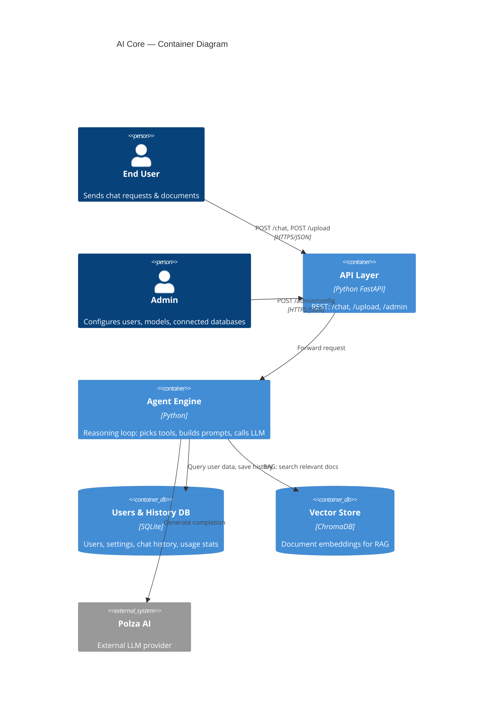
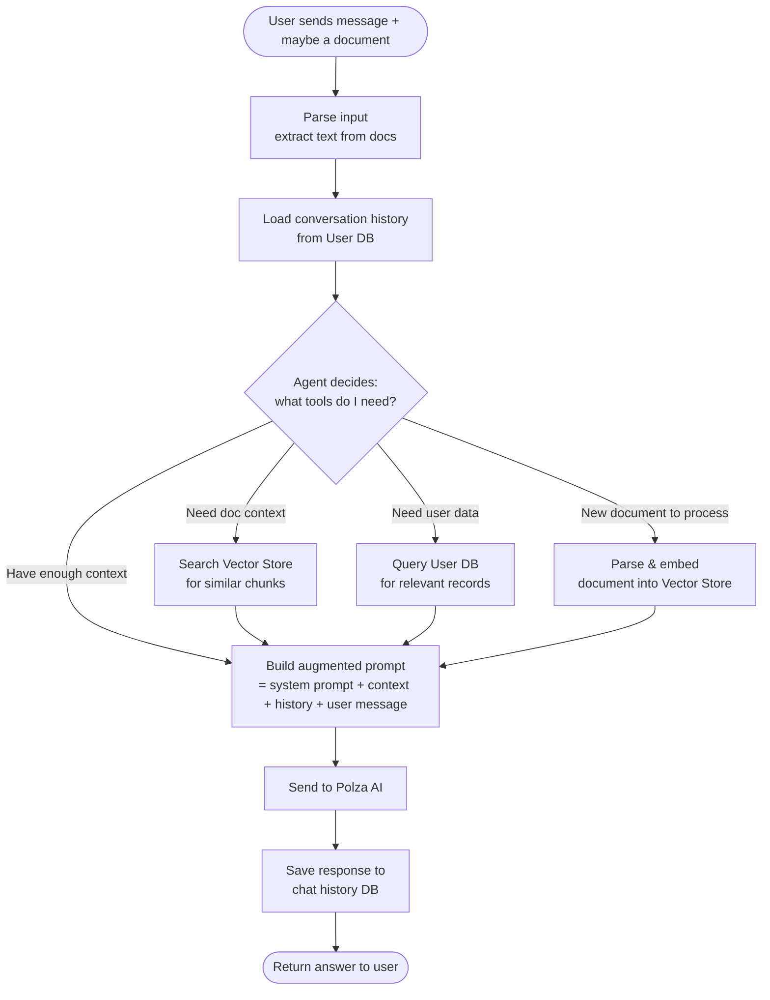

# AI Core — Architecture

## What is AI Core?

AI Core is an **AI Agent Service** — not a simple gateway.
Users interact via REST API. Behind the scenes, an agent engine decides
which tools to use (RAG search, database query, document parsing, LLM call)
to build the best possible answer.

## Container Diagram

## Request Flow (Agent Loop)

## Agent Tools

The agent can invoke these tools:

| Tool | Description | When Used |
|------|-------------|-----------|
| **RAG Search** | Searches vector store for relevant document chunks | User asks about uploaded docs |
| **DB Query** | Queries connected databases for user data | User asks about structured data |
| **Doc Parser** | Extracts text from uploaded files (txt, pdf) | User uploads a new document |
| **LLM Call** | Sends augmented prompt to Polza AI | Agent has enough context to answer |

## Future: Go Gateway Layer

In a later phase, a Go-based gateway can be added in front of the Python agent:

- JWT/API Key authentication
- PII masking before requests reach the agent
- Audit logging
- Rate limiting
- Request routing

This is an additive layer — the Python agent works independently.

## Future: Agent Intelligence

- Chain-of-thought: agent recursively refines answers
- Self-check mode: agent evaluates confidence in its response
- Web search tool: search internet while keeping private data local
- Multimodal: parse images, video, audio
