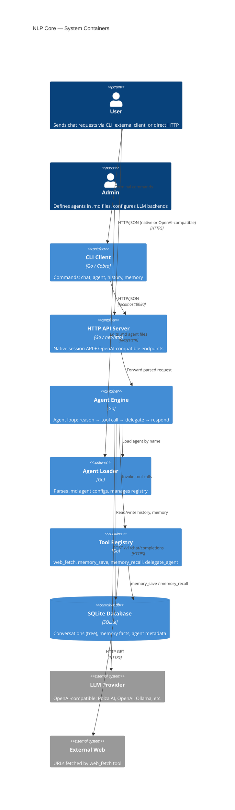

# Container Diagram — NLP Core Architecture

> Shows all major components and how they interact.

```mermaid
C4Container
    title NLP Core — System Containers

    Person(user, "User", "Sends chat requests via CLI, external client, or direct HTTP")
    Person(admin, "Admin", "Defines agents in .md files, configures LLM backends")

    Container(cli, "CLI Client", "Go / Cobra", "Commands: chat, agent, history, memory")
    Container(api, "HTTP API Server", "Go / net/http", "Native session API + OpenAI-compatible endpoints")
    Container(engine, "Agent Engine", "Go", "Agent loop: reason → tool call → delegate → respond")
    Container(loader, "Agent Loader", "Go", "Parses .md agent configs, manages registry")
    Container(tools, "Tool Registry", "Go", "web_fetch, memory_save, memory_recall, delegate_agent")
    ContainerDb(sqlite, "SQLite Database", "SQLite", "Conversations (tree), memory facts, agent metadata")

    System_Ext(llm, "LLM Provider", "OpenAI-compatible: Polza AI, OpenAI, Ollama, etc.")
    System_Ext(web, "External Web", "URLs fetched by web_fetch tool")

    Rel(user, cli, "Terminal commands")
    Rel(user, api, "HTTP/JSON (native or OpenAI-compatible)", "HTTPS")
    Rel(cli, api, "HTTP/JSON", "localhost:8080")
    Rel(admin, loader, "Edits .md agent files", "filesystem")
    Rel(api, engine, "Forward parsed request")
    Rel(engine, loader, "Load agent by name")
    Rel(engine, tools, "Invoke tool calls")
    Rel(engine, sqlite, "Read/write history, memory")
    Rel(engine, llm, "POST /v1/chat/completions", "HTTPS")
    Rel(tools, web, "HTTP GET", "HTTPS")
    Rel(tools, sqlite, "memory_save / memory_recall")
```
