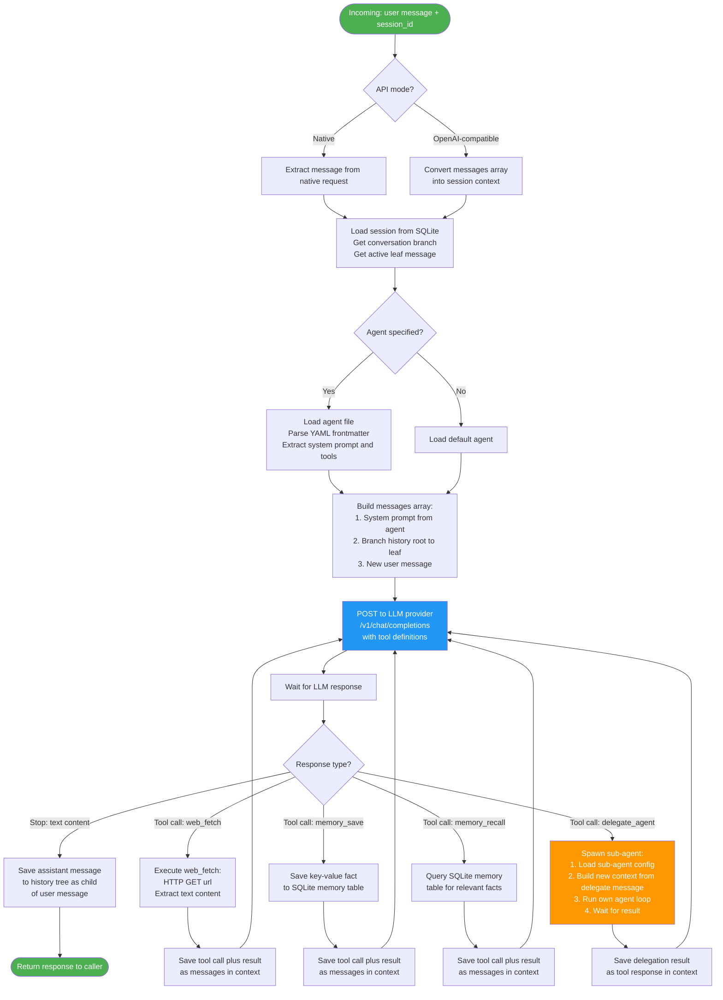

# Agent Loop — Core Engine Logic

> How the agent processes a single request from start to finish.

```mermaid
flowchart TD
    Start([Incoming: user message + session_id]) --> ParseAPI{API mode?}

    ParseAPI -->|Native| ExtractMsg[Extract message from native request]
    ParseAPI -->|OpenAI-compatible| ExtractCompat[Convert messages array<br/>into session context]

    ExtractMsg --> LoadSession
    ExtractCompat --> LoadSession

    LoadSession[Load session from SQLite<br/>Get conversation branch<br/>Get active leaf message] --> LoadAgent{Agent specified?}

    LoadAgent -->|Yes| LoadByName[Load agent file<br/>Parse YAML frontmatter<br/>Extract system prompt and tools]
    LoadAgent -->|No| LoadDefault[Load default agent]

    LoadByName --> BuildMessages
    LoadDefault --> BuildMessages

    BuildMessages["Build messages array:\n1. System prompt from agent\n2. Branch history root to leaf\n3. New user message"] --> CallLLM["POST to LLM provider\n/v1/chat/completions\nwith tool definitions"]

    CallLLM --> WaitResponse[Wait for LLM response]
    WaitResponse --> ParseResp{Response type?}

    ParseResp -->|Stop: text content| SaveText[Save assistant message<br/>to history tree as child<br/>of user message]
    SaveText --> ReturnResponse([Return response to caller])

    ParseResp -->|Tool call: web_fetch| ExecWebFetch["Execute web_fetch:\nHTTP GET url\nExtract text content"]
    ExecWebFetch --> SaveToolResult[Save tool call plus result<br/>as messages in context]
    SaveToolResult --> CallLLM

    ParseResp -->|Tool call: memory_save| ExecMemSave[Save key-value fact<br/>to SQLite memory table]
    ExecMemSave --> SaveToolResult2[Save tool call plus result<br/>as messages in context]
    SaveToolResult2 --> CallLLM

    ParseResp -->|Tool call: memory_recall| ExecMemRecall[Query SQLite memory<br/>table for relevant facts]
    ExecMemRecall --> SaveToolResult3[Save tool call plus result<br/>as messages in context]
    SaveToolResult3 --> CallLLM

    ParseResp -->|Tool call: delegate_agent| ExecDelegate["Spawn sub-agent:\n1. Load sub-agent config\n2. Build new context from delegate message\n3. Run own agent loop\n4. Wait for result"]
    ExecDelegate --> SaveToolResult4[Save delegation result<br/>as tool response in context]
    SaveToolResult4 --> CallLLM

    style Start fill:#4CAF50,color:#fff
    style ReturnResponse fill:#4CAF50,color:#fff
    style CallLLM fill:#2196F3,color:#fff
    style ExecDelegate fill:#FF9800,color:#fff
```
