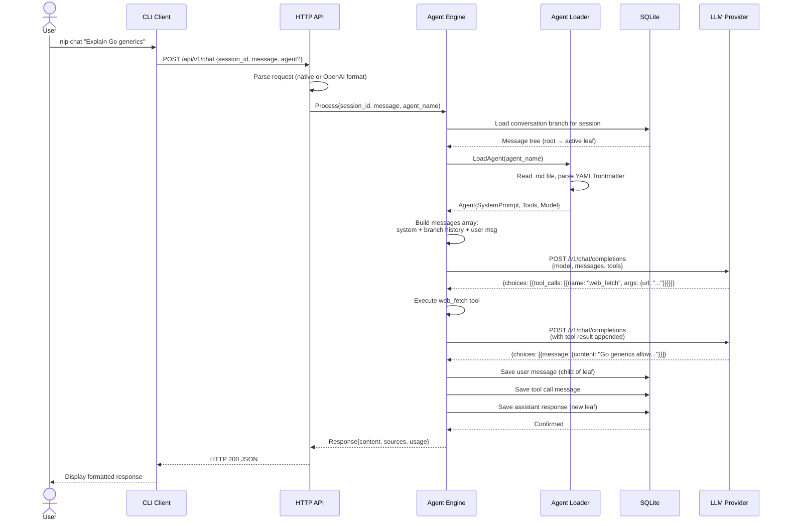

# Chat Request — End-to-End Sequence

> Shows the full lifecycle of a chat request through all layers.

```mermaid
sequenceDiagram
    actor User
    participant CLI as CLI Client
    participant API as HTTP API
    participant Engine as Agent Engine
    participant Loader as Agent Loader
    participant DB as SQLite
    participant LLM as LLM Provider

    User->>CLI: nlp chat "Explain Go generics"
    CLI->>API: POST /api/v1/chat {session_id, message, agent?}
    API->>API: Parse request (native or OpenAI format)

    API->>Engine: Process(session_id, message, agent_name)

    Engine->>DB: Load conversation branch for session
    DB-->>Engine: Message tree (root → active leaf)

    Engine->>Loader: LoadAgent(agent_name)
    Loader->>Loader: Read .md file, parse YAML frontmatter
    Loader-->>Engine: Agent{SystemPrompt, Tools, Model}

    Engine->>Engine: Build messages array:<br/>system + branch history + user msg

    Engine->>LLM: POST /v1/chat/completions<br/>{model, messages, tools}
    LLM-->>Engine: {choices: [{tool_calls: [{name: "web_fetch", args: {url: "..."}}]}]}

    Engine->>Engine: Execute web_fetch tool
    Engine->>LLM: POST /v1/chat/completions<br/>(with tool result appended)
    LLM-->>Engine: {choices: [{message: {content: "Go generics allow..."}}]}

    Engine->>DB: Save user message (child of leaf)
    Engine->>DB: Save tool call message
    Engine->>DB: Save assistant response (new leaf)
    DB-->>Engine: Confirmed

    Engine-->>API: Response{content, sources, usage}
    API-->>CLI: HTTP 200 JSON
    CLI-->>User: Display formatted response
```
