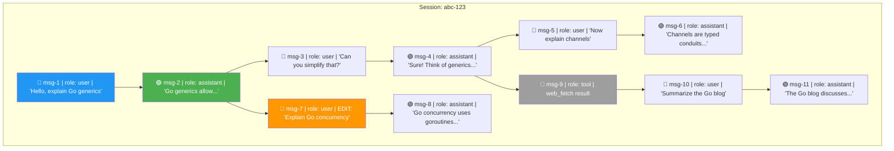

# History Tree — Branching Conversation Model

> How conversations branch when users edit messages or start new threads.

## Tree Structure

## Branch Selection Rules

| Scenario | Active Branch |
|----------|--------------|
| Default | Longest root→leaf path |
| After edit | New branch from edit point |
| Explicit branch select | User picks leaf via API |

## Key Properties

- **Immutable messages**: editing creates a NEW message node, old one stays
- **Multiple leaves**: a session can have many leaf nodes
- **One active path**: `GET /sessions/:id` returns one root→leaf path
- **Branch listing**: `GET /sessions/:id/branches` returns all leaves
- **Tool messages**: stored in tree as `role: tool` nodes, same structure
- **Delegation traces**: sub-agent calls appear as nested tool calls
