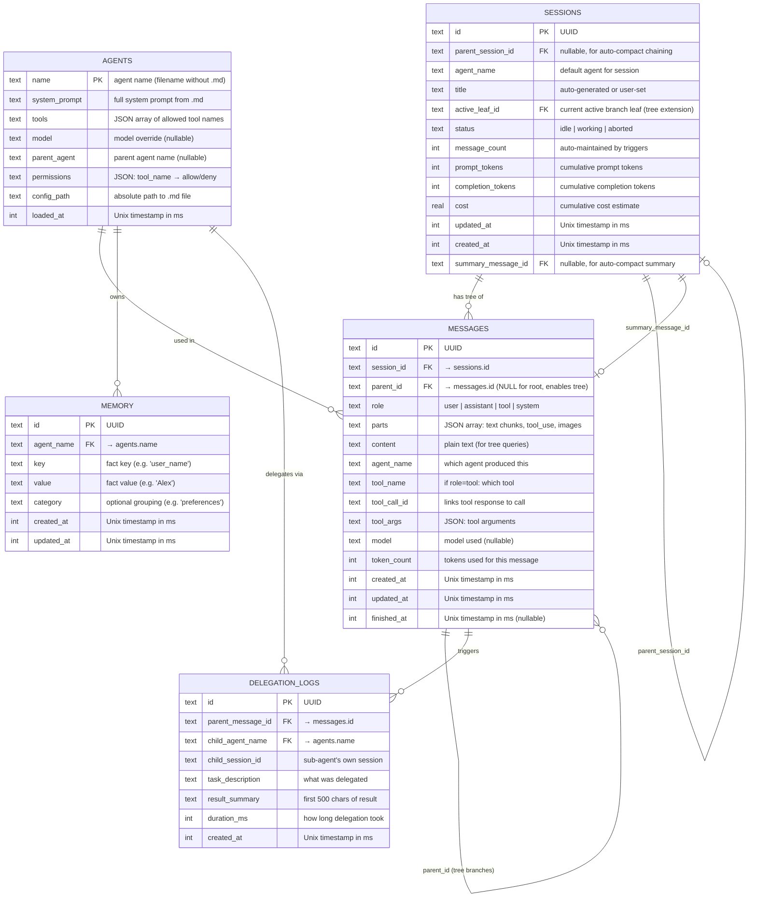

# Database ERD — SQLite Schema (OpenCode-Adapted)

> All tables in the SQLite database and their relationships.
> Storage: `.gopengai/gopengai.db` — single-file SQLite (WAL mode, pure Go via `ncruces/go-sqlite3`).
> Migrations: Goose. Query generation: sqlc.

## Key Design Decisions

- **OpenCode-compatible base:** Sessions and Messages tables match OpenCode's schema, extended with tree structure (`parent_id`, `active_leaf_id`) and agent/delegation columns.
- **Messages form a tree**, not a linear list. `parent_id` links to parent message (NULL for root).
- **`active_leaf_id`** in SESSIONS points to the current "cursor" — the leaf of the active branch.
- **`parent_session_id`** + **`summary_message_id`** enable auto-compact: when context window fills, summarize → spawn child session.
- **`parts`** column (JSON array) stores rich message content matching LLM API conventions.
- **`content`** column (plain text) is a convenience field for tree queries and display.
- **Tool messages** have `role=tool`, `tool_name`, and `tool_call_id` linking them to the assistant's tool call.
- **MEMORY** is simple key-value, scoped per agent. No vector embeddings for MVP.
- **DELEGATION_LOGS** tracks when an agent spawned a sub-agent, for debugging and transparency.
- **No separate users table** for MVP. Sessions are identified by UUID. Auth is a future concern.
- **Timestamps** are Unix milliseconds (integers), matching OpenCode's convention.
- **Triggers** auto-update `updated_at` and `message_count` on relevant changes.
