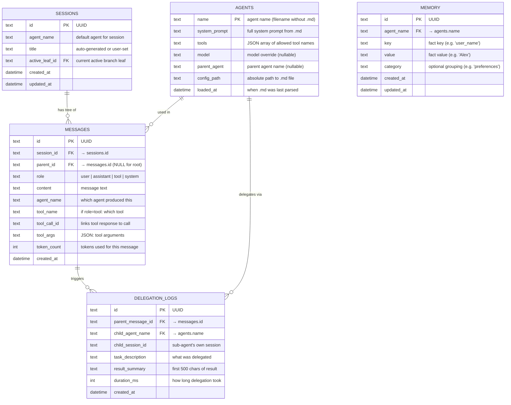

# Database ERD — SQLite Schema

> All tables in the SQLite database and their relationships.

## Key Design Decisions

- **Messages form a tree**, not a linear list. `parent_id` links to parent message.
- **`active_leaf_id`** in SESSIONS points to the current "cursor" — the leaf of the active branch.
- **Tool messages** have `role=tool`, `tool_name`, and `tool_call_id` linking them to the assistant's tool call.
- **MEMORY** is simple key-value, scoped per agent. No vector embeddings for MVP.
- **DELEGATION_LOGS** tracks when an agent spawned a sub-agent, for debugging and transparency.
- **No separate users table** for MVP. Sessions are identified by UUID. Auth is a future concern.
