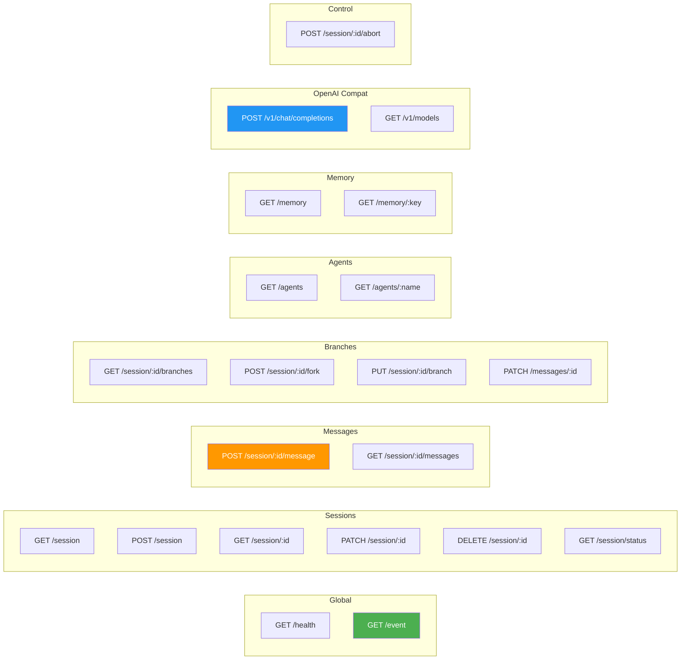
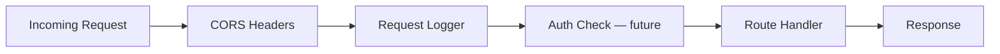

# REST API — GoPengAI Endpoint Reference

> Complete API surface: native endpoints + OpenAI-compatible + SSE events.
> Inspired by OpenCode API, adapted with explicit documentation and tree-based history.

## Endpoint Overview



---

## 1. Global Endpoints

### `GET /health`

Health check with uptime and version.

**Response (200):**
```json
{
  "status": "ok",
  "version": "0.1.0",
  "uptime": "4h32m11s"
}
```

### `GET /event`

Global Server-Sent Events stream. Client connects once to receive system-wide events.

**Event Types:**

| Event             | Data                                      | Trigger                    |
|-------------------|-------------------------------------------|----------------------------|
| `session.status`  | `{sessionID, status: "idle"/"working"}`   | Session state change       |
| `session.created` | `{sessionID, agentName}`                  | New session created        |
| `session.deleted` | `{sessionID}`                             | Session deleted            |
| `heartbeat`       | `{timestamp}`                             | Every 15s keepalive        |

**Example SSE stream:**
```
event: session.created
data: {"sessionID":"ses_abc123","agentName":"default"}

event: session.status
data: {"sessionID":"ses_abc123","status":"working"}

event: session.status
data: {"sessionID":"ses_abc123","status":"idle"}

event: heartbeat
data: {"timestamp":1748000000}
```

---

## 2. Session CRUD

### `GET /session`

List all sessions, ordered by `updated_at` descending.

**Response (200):**
```json
[
  {
    "id": "ses_abc123",
    "agent_name": "default",
    "title": "Explain Go generics",
    "status": "idle",
    "created_at": "2026-05-23T10:00:00Z",
    "updated_at": "2026-05-23T10:15:00Z"
  }
]
```

### `POST /session`

Create a new session.

**Request:**
```json
{
  "title": "optional title",
  "agent_name": "optional — defaults to configured default agent"
}
```

**Response (201):**
```json
{
  "id": "ses_xyz789",
  "agent_name": "default",
  "title": "optional title",
  "status": "idle",
  "created_at": "2026-05-23T10:20:00Z",
  "updated_at": "2026-05-23T10:20:00Z"
}
```

### `GET /session/:id`

Get session detail including active branch messages.

**Response (200):**
```json
{
  "id": "ses_abc123",
  "agent_name": "default",
  "title": "Explain Go generics",
  "status": "idle",
  "active_leaf_id": "msg_leaf42",
  "created_at": "2026-05-23T10:00:00Z",
  "updated_at": "2026-05-23T10:15:00Z"
}
```

**Response (404):**
```json
{ "error": "session not found" }
```

### `PATCH /session/:id`

Update session metadata.

**Request:**
```json
{ "title": "new title" }
```

**Response (200):** Updated session object.

### `DELETE /session/:id`

Delete session and all associated messages. Returns `true`.

**Response (200):** `true`

---

## 3. Messages (Async + SSE)

### `POST /session/:id/message` (Core Endpoint)

Send a user message. Returns immediately (202). Agent processes in background.
Response streams via the per-session message stream.

**Request:**
```json
{
  "content": "Explain Go generics",
  "agent_name": "optional — override session default"
}
```

**Response (202):**
```json
{
  "message_id": "msg_user_001",
  "session_id": "ses_abc123",
  "status": "accepted"
}
```

**Response (404):** Session not found.

#### Per-Session SSE Stream: `GET /session/:id/events`

Client subscribes to receive real-time updates for this session.

| Event                   | Data                                               | When                              |
|-------------------------|----------------------------------------------------|-----------------------------------|
| `message.part.added`    | `{messageID, role, content: ""}`                   | Assistant starts responding       |
| `message.part.updated`  | `{messageID, role, content: "partial text..."}`    | Text streaming in                 |
| `message.part.updated`  | `{messageID, role: "tool", toolName, status: "running"}` | Tool execution started      |
| `message.part.updated`  | `{messageID, role: "tool", toolName, result: "..."}`     | Tool execution complete       |
| `message.complete`      | `{messageID, role, content, usage, stopReason}`    | Full response done                |
| `message.error`         | `{error, code}`                                    | Error during generation           |
| `session.status`        | `{status: "idle"}`                                 | Processing complete               |

**Example SSE stream for a chat with tool call:**
```
event: session.status
data: {"status":"working"}

event: message.part.added
data: {"messageID":"msg_asst_001","role":"assistant","content":""}

event: message.part.updated
data: {"messageID":"msg_asst_001","role":"assistant","content":"Let me look"}

event: message.part.updated
data: {"messageID":"msg_tool_001","role":"tool","toolName":"web_fetch","status":"running"}

event: message.part.updated
data: {"messageID":"msg_tool_001","role":"tool","toolName":"web_fetch","result":"..."}

event: message.part.updated
data: {"messageID":"msg_asst_002","role":"assistant","content":"Based on the result..."}

event: message.complete
data: {"messageID":"msg_asst_002","role":"assistant","content":"Based on the result...","usage":{"tokens":342},"stopReason":"stop"}

event: session.status
data: {"status":"idle"}
```

### `GET /session/:id/messages`

Get all messages in the active branch (root → leaf path).

**Response (200):**
```json
[
  {
    "id": "msg_001",
    "role": "user",
    "content": "Explain Go generics",
    "parent_id": null,
    "created_at": "2026-05-23T10:00:00Z"
  },
  {
    "id": "msg_002",
    "role": "assistant",
    "content": "Go generics allow...",
    "parent_id": "msg_001",
    "agent_name": "default",
    "tool_calls": null,
    "token_count": 120,
    "created_at": "2026-05-23T10:00:05Z"
  }
]
```

---

## 4. Branches & History Tree

### `GET /session/:id/branches`

List all leaf nodes (branch tips) for this session.

**Response (200):**
```json
[
  {
    "id": "msg_leaf_01",
    "role": "assistant",
    "content": "first 100 chars...",
    "created_at": "2026-05-23T10:10:00Z",
    "is_active": true
  },
  {
    "id": "msg_leaf_02",
    "role": "assistant",
    "content": "first 100 chars...",
    "created_at": "2026-05-23T10:12:00Z",
    "is_active": false
  }
]
```

### `POST /session/:id/fork`

Fork session at a specific message. Creates a new session branching from that point.

**Request:**
```json
{ "message_id": "msg_002" }
```

**Response (201):** New session object with `parent_session_id` in metadata.

### `PUT /session/:id/branch`

Select which branch (leaf) is active for this session.

**Request:**
```json
{ "leaf_id": "msg_leaf_02" }
```

**Response (200):**
```json
{ "active_leaf_id": "msg_leaf_02" }
```

### `PATCH /messages/:id`

Edit a message. Creates a new branch from the parent of the edited message (immutable history).

**Request:**
```json
{ "content": "new message content" }
```

**Response (200):**
```json
{
  "new_message_id": "msg_edited_01",
  "branch_leaf_id": "msg_edited_01"
}
```

---

## 5. Agents

### `GET /agents`

List all registered agents.

**Response (200):**
```json
[
  {
    "name": "default",
    "model": "",
    "tools": [],
    "parent_agent": "",
    "config_path": "/path/to/agents/default.md"
  },
  {
    "name": "researcher",
    "model": "anthropic/claude-sonnet-4-20250514",
    "tools": ["web_fetch", "memory_save", "memory_recall"],
    "parent_agent": "",
    "config_path": "/path/to/agents/researcher.md"
  }
]
```

### `GET /agents/:name`

Get full agent detail including system prompt.

**Response (200):**
```json
{
  "name": "researcher",
  "system_prompt": "You are a research assistant...",
  "model": "anthropic/claude-sonnet-4-20250514",
  "tools": ["web_fetch", "memory_save", "memory_recall"],
  "parent_agent": "",
  "config_path": "/path/to/agents/researcher.md"
}
```

---

## 6. Memory

### `GET /memory?agent=NAME`

List all memory facts for an agent.

**Query Params:**
- `agent` (optional) — filter by agent name

**Response (200):**
```json
[
  {
    "id": "mem_001",
    "agent_name": "default",
    "key": "user_name",
    "value": "Alex",
    "category": "preferences",
    "created_at": "2026-05-23T10:00:00Z",
    "updated_at": "2026-05-23T10:00:00Z"
  }
]
```

### `GET /memory/:key?agent=NAME`

Get specific memory fact.

**Response (200):** Single memory object.
**Response (404):** `{ "error": "memory not found" }`

---

## 7. OpenAI-Compatible Endpoints

### `POST /v1/chat/completions`

Accepts OpenAI chat completions format. Maps to internal engine.

**Request:**
```json
{
  "model": "default",
  "messages": [
    {"role": "system", "content": "You are helpful."},
    {"role": "user", "content": "Hello"}
  ],
  "tools": [],
  "stream": false
}
```

**Response (200):**
```json
{
  "id": "chatcmpl-abc123",
  "object": "chat.completion",
  "model": "default",
  "choices": [
    {
      "index": 0,
      "message": {
        "role": "assistant",
        "content": "Hello! How can I help?"
      },
      "finish_reason": "stop"
    }
  ],
  "usage": {
    "prompt_tokens": 10,
    "completion_tokens": 8,
    "total_tokens": 18
  }
}
```

**Notes:**
- `model` field maps to agent name (not LLM model)
- `tools` in request are merged with agent's configured tools
- `stream: true` returns SSE with OpenAI streaming format (future)

### `GET /v1/models`

List available agents as "models".

**Response (200):**
```json
{
  "object": "list",
  "data": [
    {
      "id": "default",
      "object": "model",
      "owned_by": "gopengai"
    },
    {
      "id": "researcher",
      "object": "model",
      "owned_by": "gopengai"
    }
  ]
}
```

---

## 8. Control

### `POST /session/:id/abort`

Abort a running agent generation.

**Response (200):**
```json
{ "aborted": true }
```

**Response (400):**
```json
{ "error": "session is not currently processing" }
```

---

## Request/Response Schemas (Go Types Reference)

```go
// === Session ===
type Session struct {
    ID           string    `json:"id"`
    AgentName    string    `json:"agent_name"`
    Title        string    `json:"title"`
    ActiveLeafID string    `json:"active_leaf_id,omitempty"`
    Status       string    `json:"status"` // "idle" | "working"
    CreatedAt    time.Time `json:"created_at"`
    UpdatedAt    time.Time `json:"updated_at"`
}

type CreateSessionRequest struct {
    Title     string `json:"title,omitempty"`
    AgentName string `json:"agent_name,omitempty"`
}

// === Message ===
type Message struct {
    ID          string          `json:"id"`
    Role        string          `json:"role"` // "user"|"assistant"|"tool"|"system"
    Content     string          `json:"content"`
    ParentID    string          `json:"parent_id,omitempty"`
    AgentName   string          `json:"agent_name,omitempty"`
    ToolName    string          `json:"tool_name,omitempty"`
    ToolCallID  string          `json:"tool_call_id,omitempty"`
    ToolCalls   json.RawMessage `json:"tool_calls,omitempty"`
    TokenCount  int             `json:"token_count,omitempty"`
    CreatedAt   time.Time       `json:"created_at"`
}

type SendMessageRequest struct {
    Content   string `json:"content"`
    AgentName string `json:"agent_name,omitempty"`
}

type SendMessageResponse struct {
    MessageID string `json:"message_id"`
    SessionID string `json:"session_id"`
    Status    string `json:"status"` // "accepted"
}

// === Branch ===
type Branch struct {
    ID         string    `json:"id"`
    Role       string    `json:"role"`
    Content    string    `json:"content"`
    CreatedAt  time.Time `json:"created_at"`
    IsActive   bool      `json:"is_active"`
}

type SelectBranchRequest struct {
    LeafID string `json:"leaf_id"`
}

// === Agent ===
type AgentInfo struct {
    Name         string   `json:"name"`
    SystemPrompt string   `json:"system_prompt,omitempty"`
    Model        string   `json:"model,omitempty"`
    Tools        []string `json:"tools"`
    ParentAgent  string   `json:"parent_agent,omitempty"`
    ConfigPath   string   `json:"config_path,omitempty"`
}

// === Memory ===
type MemoryFact struct {
    ID        string    `json:"id"`
    AgentName string    `json:"agent_name"`
    Key       string    `json:"key"`
    Value     string    `json:"value"`
    Category  string    `json:"category,omitempty"`
    CreatedAt time.Time `json:"created_at"`
    UpdatedAt time.Time `json:"updated_at"`
}

// === SSE Events ===
type SSEEvent struct {
    Type       string      `json:"type"`
    Properties interface{} `json:"properties"`
}

// === OpenAI Compatible ===
type OAIChatRequest struct {
    Model    string           `json:"model"`
    Messages []OAIAPIMessage  `json:"messages"`
    Tools    []json.RawMessage `json:"tools,omitempty"`
    Stream   bool             `json:"stream,omitempty"`
}

type OAIChatResponse struct {
    ID      string     `json:"id"`
    Object  string     `json:"object"`
    Model   string     `json:"model"`
    Choices []OAIChoice `json:"choices"`
    Usage   OAIUsage   `json:"usage"`
}
```

---

## Middleware Stack



| Middleware        | Behavior                                          |
|------------------|---------------------------------------------------|
| CORS             | `Access-Control-Allow-Origin: *`, methods, headers |
| Request Logger   | Method, path, status, duration → structured log   |
| Auth (future)    | API key or JWT — skeleton only for MVP             |
| Session Status   | Tracks working/idle per session                    |
| Recovery         | Panic recovery → 500 with error message            |
