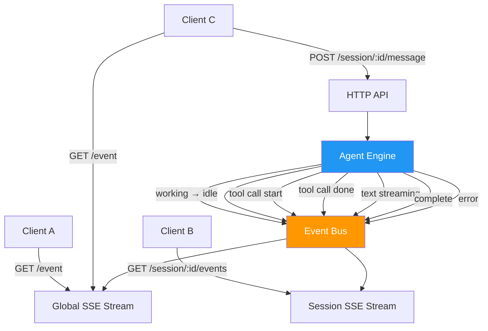
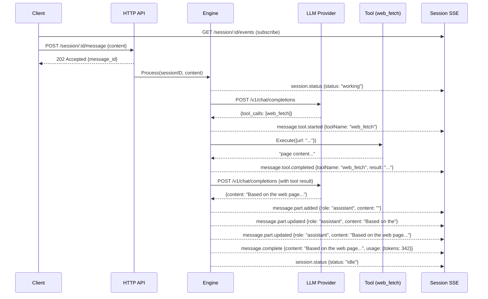

# SSE Event System — Real-Time Streaming

> GoPengAI uses Server-Sent Events for all real-time communication.
> Inspired by OpenCode's event model, adapted with explicit session-scoped streams.

## Architecture



---

## Global Stream: `GET /event`

System-wide event bus. All clients connect here for session lifecycle events.

### Event Types

```
event: session.created
data: {"type":"session.created","properties":{"sessionID":"ses_abc","agentName":"default"}}
```

```
event: session.deleted
data: {"type":"session.deleted","properties":{"sessionID":"ses_abc"}}
```

```
event: session.status
data: {"type":"session.status","properties":{"sessionID":"ses_abc","status":"working"}}
```

```
event: session.status
data: {"type":"session.status","properties":{"sessionID":"ses_abc","status":"idle"}}
```

```
event: heartbeat
data: {"type":"heartbeat","timestamp":1748000000}
```

---

## Session Stream: `GET /session/:id/events`

Scoped to a single session. Client subscribes after sending a message.

### Full Event Lifecycle for One Request



### Event Catalog

| Event                    | When                            | Properties                                              |
|--------------------------|---------------------------------|---------------------------------------------------------|
| `session.status`         | Engine state changes            | `sessionID`, `status: "idle"/"working"`                |
| `message.part.added`     | New message node created        | `messageID`, `role`, `content: ""`                      |
| `message.part.updated`   | Content appends (text streaming)| `messageID`, `role`, `content`                          |
| `message.tool.started`   | Tool execution begins           | `messageID`, `toolName`, `args`                         |
| `message.tool.completed` | Tool execution finishes         | `messageID`, `toolName`, `result`, `duration_ms`        |
| `message.tool.error`     | Tool execution fails            | `messageID`, `toolName`, `error`                        |
| `message.complete`       | Full assistant response done    | `messageID`, `role`, `content`, `usage`, `stopReason`  |
| `message.error`          | Generation failed               | `error`, `code`                                         |

### Example Full Stream

```
event: session.status
data: {"type":"session.status","properties":{"sessionID":"ses_abc","status":"working"}}

event: message.part.added
data: {"type":"message.part.added","properties":{"messageID":"msg_asst_001","role":"assistant","content":""}}

event: message.tool.started
data: {"type":"message.tool.started","properties":{"messageID":"msg_tool_001","toolName":"web_fetch","args":{"url":"https://go.dev/doc/generics"}}}

event: message.tool.completed
data: {"type":"message.tool.completed","properties":{"messageID":"msg_tool_001","toolName":"web_fetch","result":"Go generics were introduced in Go 1.18...","duration_ms":842}}

event: message.part.updated
data: {"type":"message.part.updated","properties":{"messageID":"msg_asst_002","role":"assistant","content":"Based on the official Go docs, "}}

event: message.part.updated
data: {"type":"message.part.updated","properties":{"messageID":"msg_asst_002","role":"assistant","content":"Based on the official Go docs, generics were introduced in Go 1.18 and allow you to write functions that work with multiple types."}}

event: message.complete
data: {"type":"message.complete","properties":{"messageID":"msg_asst_002","role":"assistant","content":"Based on the official Go docs, generics were introduced in Go 1.18 and allow you to write functions that work with multiple types.","usage":{"prompt_tokens":120,"completion_tokens":45,"total_tokens":165},"stopReason":"stop"}}

event: session.status
data: {"type":"session.status","properties":{"sessionID":"ses_abc","status":"idle"}}
```

---

## Go Implementation: Event Bus

```mermaid
classDiagram
    class EventBus {
        +Subscribe(sessionID string) chan SSEEvent
        +Unsubscribe(sessionID string, ch chan SSEEvent)
        +PublishGlobal(event SSEEvent)
        +PublishSession(sessionID string, event SSEEvent)
    }

    class SSEEvent {
        +string Type
        +interface{} Properties
    }

    class SSEWriter {
        +WriteEvent(w http.ResponseWriter, event SSEEvent)
    }

    EventBus --> SSEEvent : publishes
    SSEWriter --> SSEEvent : serializes
```

### In-Memory Event Bus Design

```go
// internal/api/events.go

type EventBus struct {
    mu          sync.RWMutex
    global      []chan SSEEvent          // all connected global listeners
    sessions    map[string][]chan SSEEvent // sessionID → listeners
}

// Subscribe returns a channel that receives events for a session.
func (eb *EventBus) Subscribe(sessionID string) <-chan SSEEvent

// Unsubscribe removes a listener channel.
func (eb *EventBus) Unsubscribe(sessionID string, ch <-chan SSEEvent)

// PublishGlobal sends event to all global listeners.
func (eb *EventBus) PublishGlobal(event SSEEvent)

// PublishSession sends event to all listeners of a specific session.
func (eb *EventBus) PublishSession(sessionID string, event SSEEvent)
```

---

## Client Reconnection Strategy

| Scenario                | Recommended Behavior                                  |
|-------------------------|-------------------------------------------------------|
| SSE connection drops    | Reconnect after 3s, with `Last-Event-ID` header       |
| Heartbeat timeout       | Reconnect if no heartbeat received within 30s         |
| Session not found       | Do not retry — session was deleted                    |
| Network error           | Exponential backoff: 1s, 2s, 4s, max 30s              |

---

## Design Notes

- **No message ordering guarantees across sessions** — events are session-scoped
- **Heartbeat every 15s** — prevents proxy/load-balancer connection timeouts
- **Non-blocking publish** — slow listeners are dropped (channel with buffer)
- **Session events are ephemeral** — not persisted, missed events cannot be replayed
- **Future: persistent event log** — for reconnect with `Last-Event-ID` (out of MVP scope)
