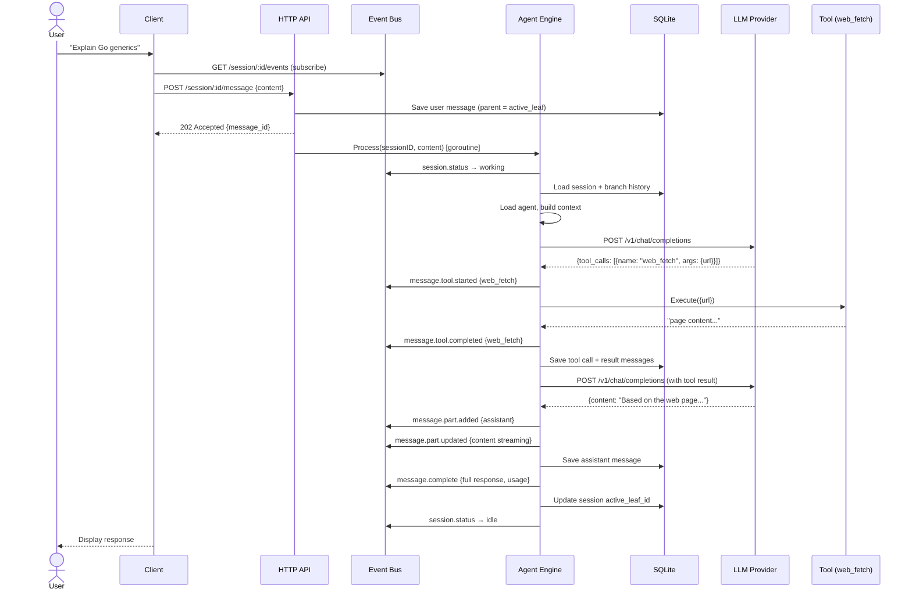
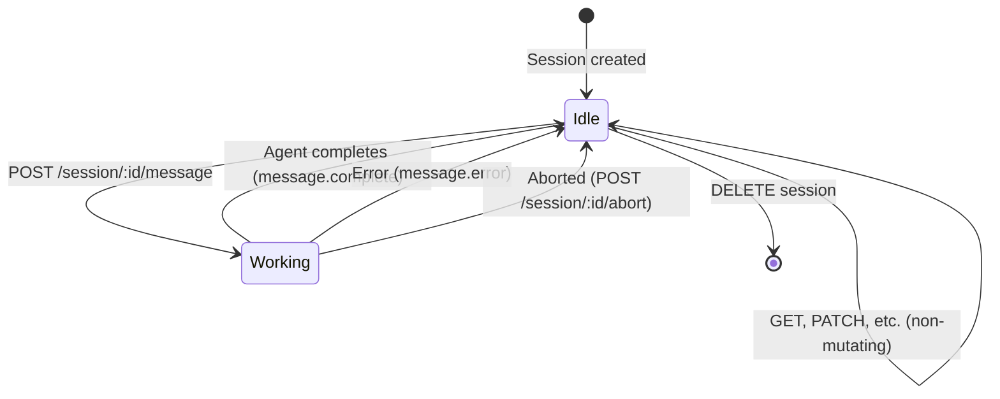
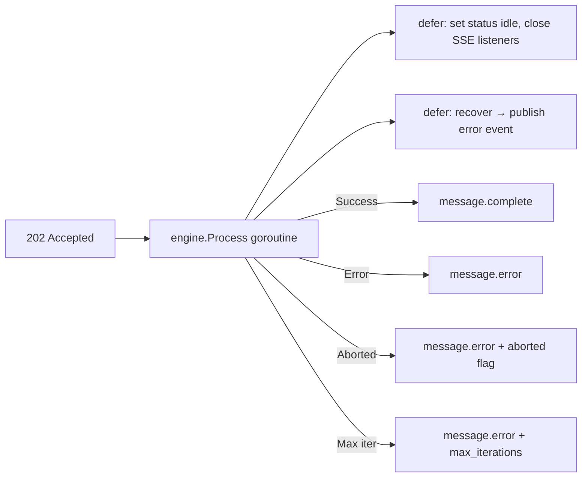
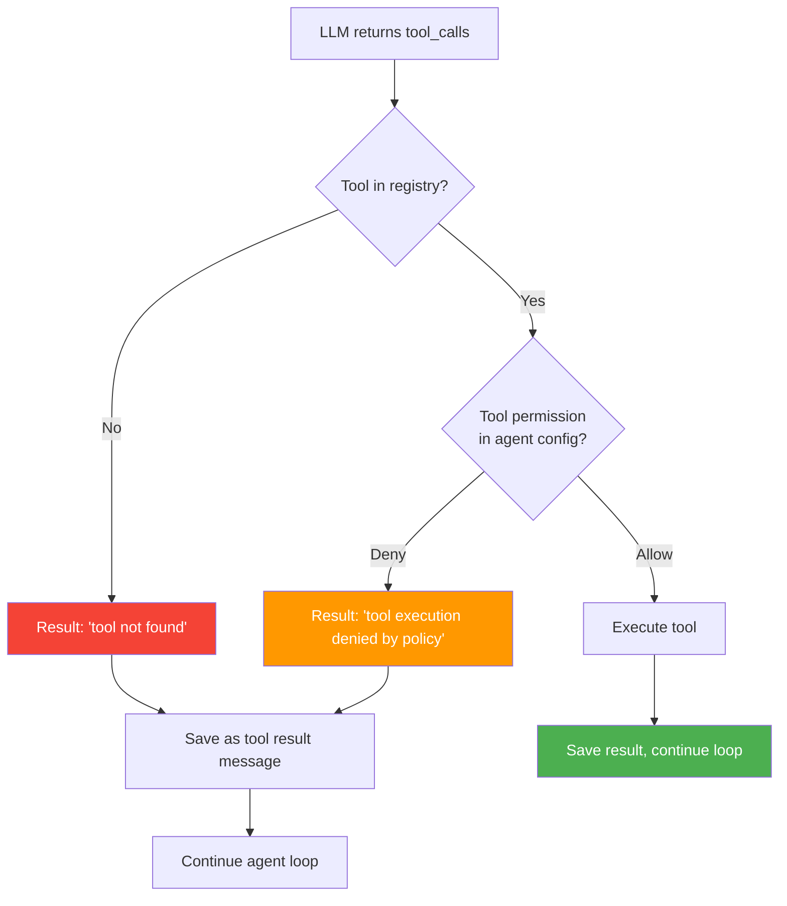
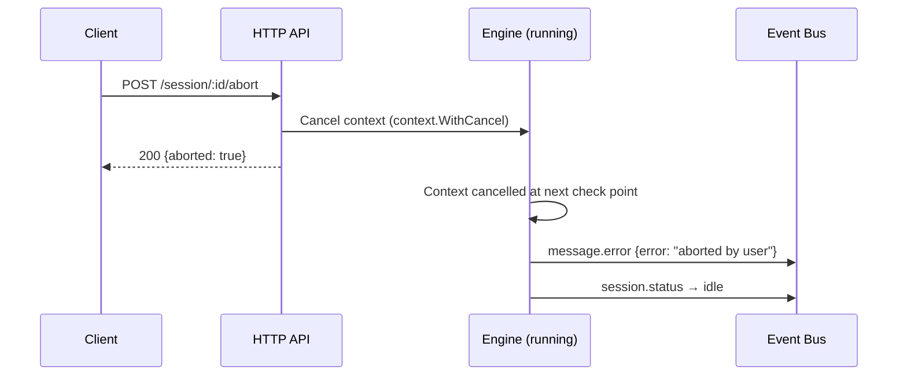

# Message Flow — Async Agent Processing

> How a message flows through the system from POST to completion.
> GoPengAI uses async processing: POST returns 202, response streams via SSE.

## Flow Diagram

```mermaid
flowchart TD
    Start([POST /session/:id/message]) --> Parse[Parse request body]
    Parse --> Validate{Valid?}

    Validate -->|No| Err400[400 Bad Request]
    Validate -->|Yes| LoadSession{Session exists?}

    LoadSession -->|No| Err404[404 Not Found]
    LoadSession -->|Yes| SaveUser[Save user message to tree<br/>parent = active_leaf]

    SaveUser --> Accepted[Return 202 Accepted<br/>{message_id, status: accepted}]

    Accepted --> BG[Start background goroutine]

    BG --> SetWorking[Set session status: working<br/>Publish session.status via SSE]
    SetWorking --> LoadAgent{Agent specified?}

    LoadAgent -->|Yes| LoadByName[Load agent from registry]
    LoadAgent -->|No| LoadDefault[Load session default agent]

    LoadByName --> BuildContext
    LoadDefault --> BuildContext

    BuildContext["Build context:<br/>1. System prompt<br/>2. Branch history (root → leaf)<br/>3. New user message"]

    BuildContext --> CallLLM[POST /v1/chat/completions<br/>to LLM provider]

    CallLLM --> ParseResp{Response type?}

    ParseResp -->|Stop: text| SaveAssistant[Save assistant message<br/>Publish message.part.added<br/>Publish message.part.updated]
    SaveAssistant --> Done[Publish message.complete<br/>Set session status: idle]

    ParseResp -->|Tool calls| ExecTools[Publish message.tool.started<br/>for each tool]

    ExecTools --> ToolPerm{Tool allowed?}

    ToolPerm -->|Deny| ToolDenied[Save tool result: denied<br/>Publish message.tool.error]
    ToolDenied --> CallLLM

    ToolPerm -->|Allow| RunTool[Execute tool]
    RunTool --> SaveToolResult[Save tool call + result messages<br/>Publish message.tool.completed]
    SaveToolResult --> LoopCheck{Max iterations<br/>reached?}

    LoopCheck -->|No| CallLLM
    LoopCheck -->|Yes| ForcedStop[Force stop<br/>Publish message.error]

    Done --> Return([Background goroutine exits])
    ForcedStop --> Return

    style Start fill:#4CAF50,color:#fff
    style Accepted fill:#FF9800,color:#fff
    style Done fill:#4CAF50,color:#fff
    style Err400 fill:#f44336,color:#fff
    style Err404 fill:#f44336,color:#fff
```

---

## Sequence: Full Message Lifecycle



---

## Session Status State Machine



---

## Background Goroutine Lifecycle



---

## Tool Permission Check



---

## Abort Flow



---

## Design Invariants

1. **User message is always saved before 202 is returned** — ensures no message loss
2. **Session status is always reset to idle** — even on panic (via defer)
3. **Max iteration limit** — prevents infinite tool call loops (default: 10)
4. **Context cancellation** — abort kills LLM calls in progress
5. **Tool results always saved** — even errors are persisted for debugging
6. **Active leaf updated after full response** — not after each intermediate message
