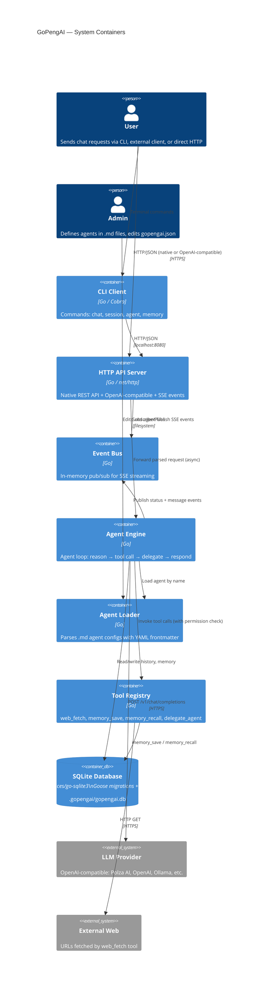
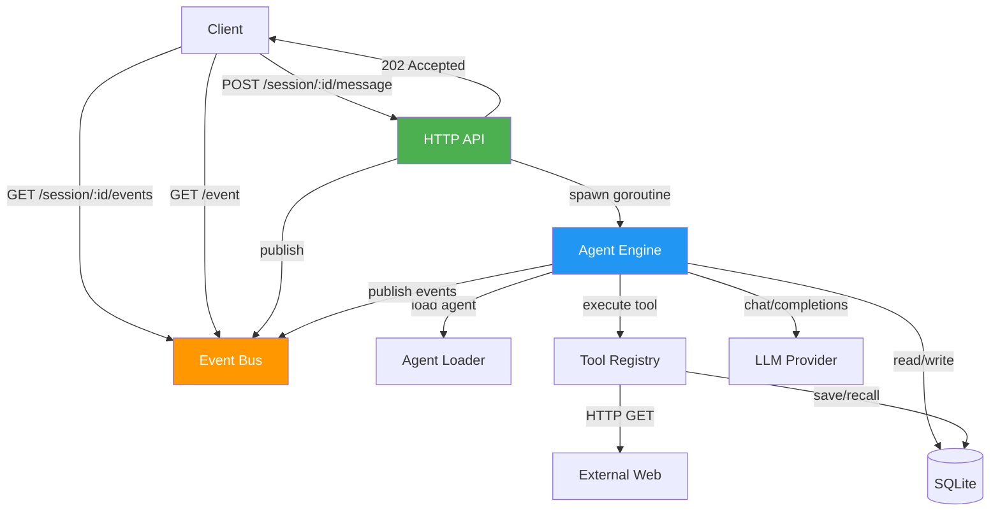

# Container Diagram — GoPengAI Architecture

> Updated container diagram reflecting the gopengai project with async API + SSE event system.
> Replaces: 01-container.md (original nlpcore diagram kept for reference).

## Key Differences from nlpcore (01-container.md)

| Aspect | nlpcore (old) | gopengai (new) |
|--------|---------------|----------------|
| API model | Synchronous POST → response | Async POST (202) + SSE event stream |
| Event system | None | In-memory Event Bus (global + per-session) |
| Config | Env vars only | `gopengai.json` + `.md` agent files |
| Database | Raw SQL, manual CRUD | SQLite + Goose migrations + sqlc codegen |
| DB driver | N/A | `ncruces/go-sqlite3` (pure Go, no CGo) |
| Data location | N/A | `.gopengai/gopengai.db` (per-project) |
| Tool permissions | All auto-execute | Per-agent allow/deny per tool |
| OpenAI compat | Mentioned | Full implementation with `/v1/chat/completions` + `/v1/models` |
| CLI client | Cobra HTTP client | Cobra + SSE subscription for streaming |

## Component Interactions

