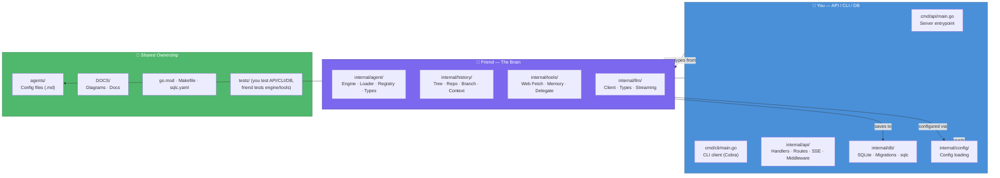

# Who Wrote What — Dev Split



---

## Your Part — API / CLI / DB

**Theme:** Infrastructure, data persistence, and user-facing interfaces.

| Directory | What you built | Why it's yours |
|-----------|---------------|----------------|
| **`cmd/api/main.go`** | Server entrypoint: load config → open DB → migrate → init sqlc → create LLM client → wire handler → start HTTP server | API surface |
| **`cmd/cli/main.go`** | Cobra CLI with `chat` (single + REPL) and `session` (list/show/create/delete) commands | CLI surface |
| **`internal/api/handler.go`** | HTTP handlers: session CRUD, chat message (transaction-safe), OpenAI-compatible pass-through, error handling | API logic |
| **`internal/api/routes.go`** | Route registration with Go 1.22+ method routing | API wiring |
| **`internal/api/events.go`** | EventBus + SSE streaming stub | API plumbing |
| **`internal/api/middleware.go`** | Logging, CORS, recovery, auth | API plumbing |
| **`internal/db/`** | SQLite connection (ncruces/go-sqlite3, pure Go), Goose migrations (5 tables + triggers + indexes), sqlc query definitions and generated code | DB layer |
| **`internal/config/config.go`** | Config struct, JSON loading, env var overrides | Config |
| **`sqlc.yaml`** | sqlc engine config | Your tooling |

**What you'd say:** *"I handled all the boring but important stuff — making sure data gets saved to disk, requests come in and responses go out, and the user has a nice CLI to talk to it."*

---

## Friend's Part — The Brain

**Theme:** Domain logic — what makes the project interesting.

| Directory | What they built | Why it's theirs |
|-----------|---------------|-----------------|
| **`internal/agent/engine.go`** | Core agent loop: context building → LLM call → tool execution → event publishing → loop/stop | The heart of the system |
| **`internal/agent/loader.go`** | YAML frontmatter parser for `.md` agent config files (name, model, tools, permissions) | Agent domain |
| **`internal/agent/registry.go`** | In-memory concurrency-safe agent registry | Agent domain |
| **`internal/agent/types.go`** | Agent, Message, ToolCall, Response, Usage structs | Domain types |
| **`internal/history/tree.go`** | Tree construction, longest-path, BFS, leaf detection, conversion to LLM messages | Conversation logic |
| **`internal/history/repo.go`** | Repository wrapper around sqlc queries for history operations | History domain |
| **`internal/history/branch.go`** | Branch selection, message edit→new branch, session fork (all transactional) | Branching logic |
| **`internal/history/context.go`** | Session context builder with truncation | Context assembly |
| **`internal/tools/registry.go`** | Tool interface definition, registry, permission checking | Tool infrastructure |
| **`internal/tools/web_fetch.go`** | HTTP fetch tool (GET URL, strip HTML, return N chars) | Tool impl |
| **`internal/tools/memory.go`** | MemorySave + MemoryRecall tools scoped to agent | Tool impl |
| **`internal/tools/delegate.go`** | Sub-agent delegation with cycle detection and timeout | Tool impl |
| **`internal/llm/client.go`** | OpenAI-compatible HTTP client (ChatCompletion, tool support) | LLM integration |
| **`internal/llm/types.go`** | ChatCompletionRequest, Message, ToolDefinition, ToolCall, etc. | LLM types |
| **`internal/llm/stream.go`** | SSE parsing infrastructure | LLM streaming |

**What they'd say:** *"I built the brain — agents that think, tools that fetch and remember, conversations that branch like git. Your API just calls my functions."*

---

## Shared Ownership

| Thing | Who worked on it |
|-------|-----------------|
| **`agents/default.md` + `agents/examples/`** | Friend (designed) + You (decided the config format is `.md` files) |
| **`DOCS/diagrams/`** | Both — you diagrammed API/DB/SSE, friend diagrammed agent loop/history tree |
| **`go.mod` / `go.sum` / `Makefile`** | Both — dependencies and build commands |
| **Tests** | Each tests their own code |
| **`README.md`** | Both — you wrote API/CLI sections, friend wrote engine/tools sections |
| **`.gitignore` / `gopengai.json.example`** | You (part of project bootstrap) |

---

## The Contract Between You

The boundary is clean:

```
Your API handler  ──calls──→  Friend's LLM client
                                  ↓
Your DB layer  ←──saves to──  Friend's Engine
                                  ↓
                          Friend's Tools
```

- You own **how data enters/leaves/stores**.
- Friend owns **what happens to it in between**.
- You both touch `gopengai.json` — you load it, friend's engine reads fields from it.