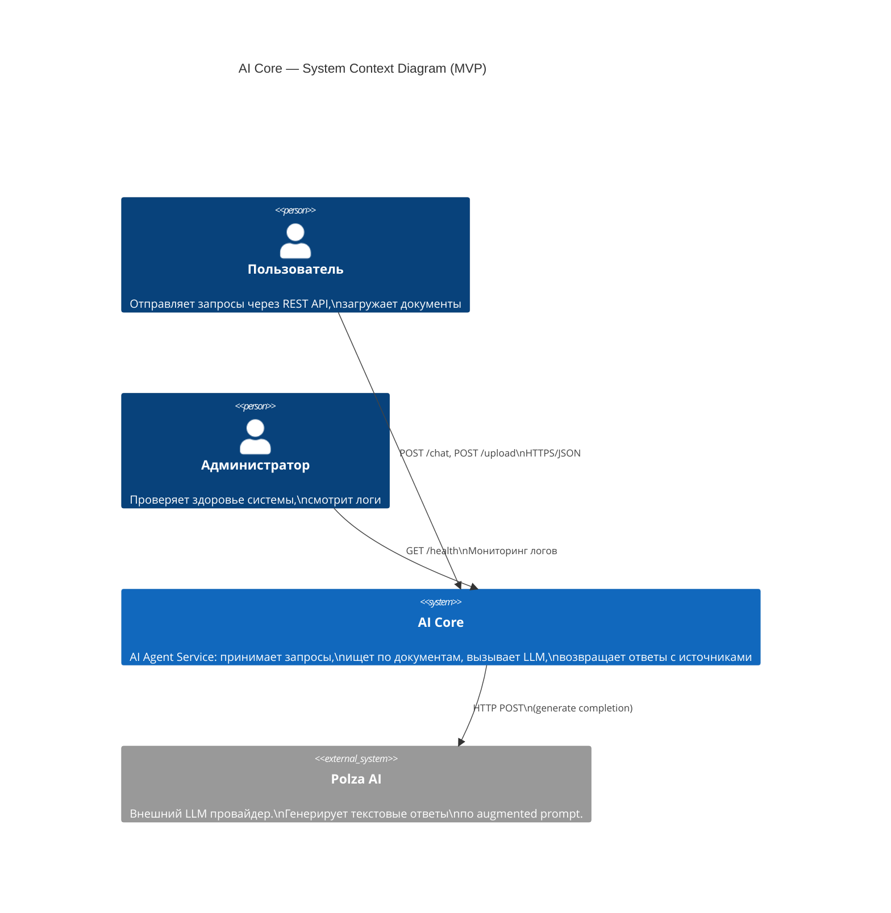

# AI Core — MVP: Системный контекст (C4 Level 1)

> Показывает AI Core в контексте внешних пользователей и систем.

## Описание

| Актор | Роль |
|-------|------|
| **Пользователь** | Основной потребитель. Отправляет вопросы, загружает документы, получает AI-ответы с указанием источников |
| **Администратор** | Следит за состоянием системы через health-check и логи |
| **AI Core** | Центральная система — AI агент с RAG, парсингом документов и интеграцией с Polza AI |
| **Polza AI** | Внешний сервис LLM. AI Core отправляет augmented prompt, получает текстовый ответ |

## Ключевые потоки

1. **Чат:** Пользователь → `POST /chat` → AI Core → Polza AI → ответ с источниками
2. **Загрузка:** Пользователь → `POST /upload` → AI Core (парсинг + эмбеддинг) → подтверждение
3. **Мониторинг:** Администратор → `GET /health` + просмотр логов
