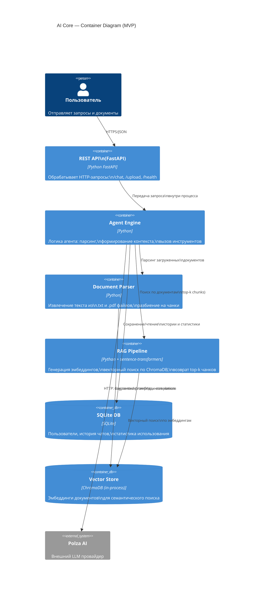

# AI Core — MVP: Контейнерная диаграмма (C4 Level 2)

> Внутренняя архитектура AI Core: сервисы, хранилища, потоки данных.

## Описание контейнеров

| Контейнер | Технология | Ответственность |
|-----------|------------|-----------------|
| **REST API** | Python FastAPI | Входная точка. Валидация запросов, маршрутизация, возврат ответов |
| **Agent Engine** | Python | Оркестрация: определяет какие инструменты вызвать, формирует prompt, вызывает Polza AI |
| **Document Parser** | Python (PyMuPDF/pdfplumber) | Извлекает текст из .txt/.pdf, разбивает на чанки, передаёт в RAG Pipeline |
| **RAG Pipeline** | sentence-transformers + ChromaDB | Генерирует эмбеддинги, выполняет семантический поиск, возвращает релевантные чанки |
| **SQLite DB** | SQLite (file) | Постоянное хранение: таблицы users, messages, usage_stats |
| **ChromaDB** | ChromaDB (in-process) | Векторное хранилище: эмбеддинги документов для RAG-поиска |
| **Polza AI** | HTTP API | Внешний LLM: получает augmented prompt, возвращает текстовый ответ |
