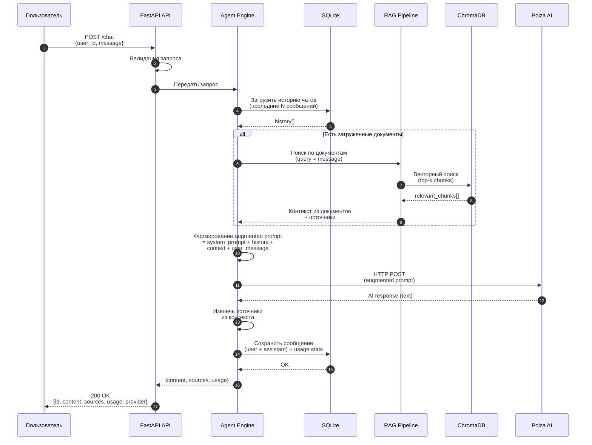

# AI Core — MVP: Последовательность /chat запроса

> Жизненный цикл одного чат-запроса: от пользователя до ответа.



## Описание шагов

| Шаг | Действие | Детали |
|-----|----------|--------|
| 1 | Пользователь отправляет запрос | `POST /chat` с `user_id` и `message` |
| 2 | Валидация | Проверка формата, обязательных полей |
| 3 | Загрузка истории | Последние N сообщений из SQLite для контекста |
| 4-6 | RAG поиск (если есть документы) | Векторный поиск по ChromaDB → top-k чанков → контекст + источники |
| 7 | Формирование prompt | System prompt + история + контекст документов + сообщение пользователя |
| 8-9 | Вызов LLM | HTTP POST к Polza AI → текстовый ответ |
| 10 | Извлечение источников | Откуда пришёл контекст (документ, страница) |
| 11-12 | Сохранение | Сообщения + статистика в SQLite |
| 13-14 | Возврат ответа | JSON: id, content, sources, token usage, provider |

## Формат ответа

```json
{
  "id": "req_abc123",
  "content": "Ответ AI на основе документов и контекста...",
  "sources": [
    {"document": "policy_v2.pdf", "page": 3, "chunk": "..."}
  ],
  "usage": {"prompt_tokens": 85, "completion_tokens": 45, "total": 130},
  "provider": "polza"
}
```
