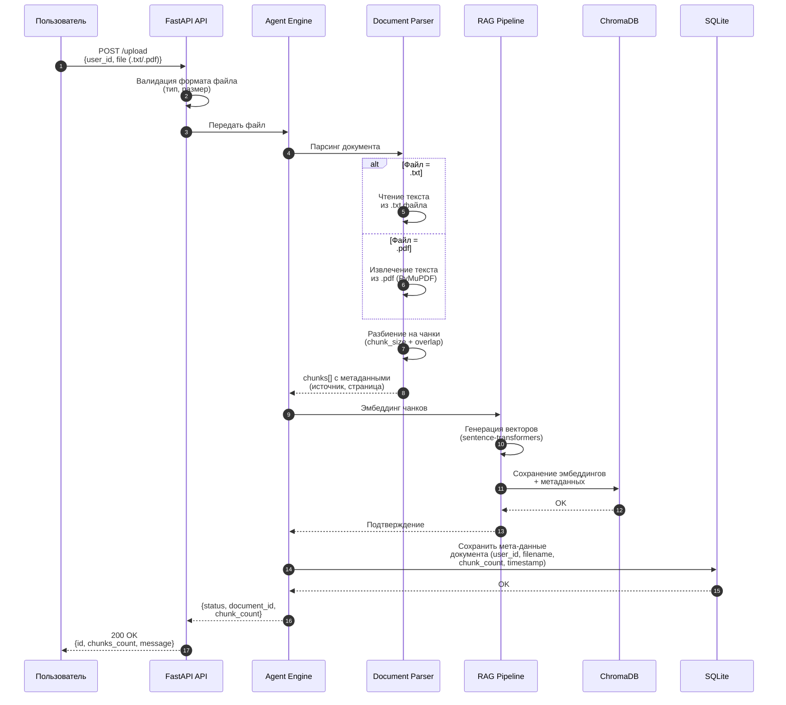

# AI Core — MVP: Последовательность /upload запроса

> Жизненный цикл загрузки документа: парсинг, эмбеддинг, сохранение.

## Описание шагов

| Шаг | Действие | Детали |
|-----|----------|--------|
| 1 | Пользователь загружает файл | `POST /upload` с `user_id` и файлом (.txt / .pdf) |
| 2 | Валидация | Проверка типа файла, размера |
| 3 | Передача в парсер | Файл передаётся в Document Parser |
| 4-5 | Парсинг | Извлечение текста (txt = чтение, pdf = PyMuPDF) |
| 6 | Разбиение на чанки | Chunk size ~500 токенов, overlap ~50 |
| 7 | Возврат чанков | Массив чанков с метаданными (файл, страница) |
| 8-10 | Эмбеддинг | sentence-transformers → векторы → сохранение в ChromaDB |
| 11-12 | Метаданные в SQLite | filename, chunk_count, timestamp, user_id |
| 13-14 | Ответ пользователю | `{id, chunks_count, message: "Документ загружен"}` |

## Важно

- После загрузки документа, следующие `/chat` запросы от этого пользователя
  **автоматически** будут искать по загруженным документам (RAG).
- Документы привязаны к `user_id` — каждый пользователь видит только свои.
