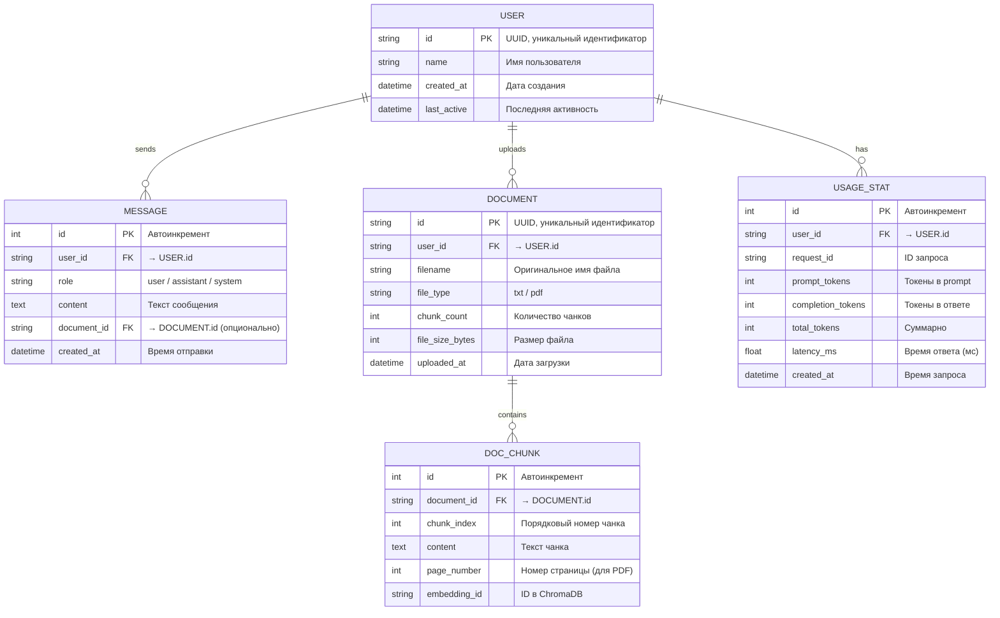

# AI Core — MVP: Схема базы данных (ERD)

> Структура SQLite базы данных для MVP.



## Описание таблиц

| Таблица | Назначение | Ключевые поля |
|---------|------------|---------------|
| **USER** | Пользователи системы | `id` (UUID), `name`, timestamps |
| **MESSAGE** | История всех сообщений | `user_id`, `role`, `content`, `created_at` |
| **DOCUMENT** | Загруженные документы | `user_id`, `filename`, `file_type`, `chunk_count` |
| **DOC_CHUNK** | Разбиения документов на чанки | `document_id`, `chunk_index`, `content`, `page_number` |
| **USAGE_STAT** | Статистика использования API | `user_id`, token counts, `latency_ms` |

## Связи

```
USER ──(1:N)──> MESSAGE        Пользователь имеет много сообщений
USER ──(1:N)──> DOCUMENT       Пользователь загружает много документов
USER ──(1:N)──> USAGE_STAT     Статистика по каждому запросу
DOCUMENT ──(1:N)──> DOC_CHUNK  Документ разбит на чанки
```

## Примечания

- **DOC_CHUNK хранит только текст и метаданные.** Векторные эмбеддинги
  хранятся в ChromaDB, а ссылка на них — в поле `embedding_id`.
- **MESSAGE.role** принимает значения: `user` (запрос), `assistant` (ответ),
  `system` (системные сообщения агента).
- **USAGE_STAT** нужна для мониторинга и потенциальной тарификации.
