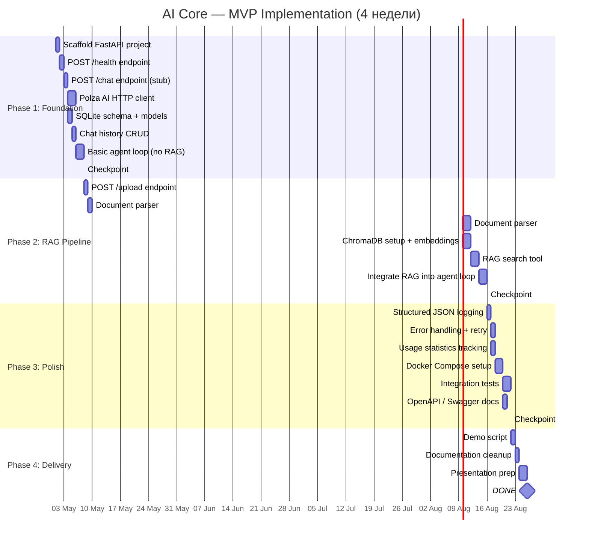

# AI Core — MVP: Фазы реализации (Gantt Chart)

> План реализации MVP на ~4 недели.

## Описание фаз

### Phase 1: Foundation (Неделя 1)
**Цель:** Рабочий чат через curl.

| Задача | Детали |
|--------|--------|
| Scaffold FastAPI | Структура проекта, `main.py`, `requirements.txt` |
| /health | Проверка доступности сервиса |
| /chat (stub) | Принимает запрос, возвращает заглушку |
| Polza AI client | HTTP POST к API, обработка ответа |
| SQLite schema | Таблицы: `users`, `messages`, `usage_stats` |
| Chat history | CRUD для сообщений |
| Agent loop | prompt → Polza AI → save → return |

### Phase 2: RAG Pipeline (Неделя 2-3)
**Цель:** Загрузка документов + вопросы по ним.

| Задача | Детали |
|--------|--------|
| /upload | Принимает файл, валидирует |
| Parser .txt | Чтение текстовых файлов |
| Parser .pdf | PyMuPDF / pdfplumber |
| ChromaDB | In-process setup, коллекция для эмбеддингов |
| RAG search | Векторный поиск → top-k чанков |
| Integrate | Agent ищет по документам перед LLM |

### Phase 3: Polish (Неделя 3-4)
**Цель:** Готовность к демонстрации.

| Задача | Детали |
|--------|--------|
| Logging | JSON structured: user_id, timestamp, tokens |
| Error handling | Retry LLM calls, валидация входов |
| Usage stats | Запись token usage в SQLite |
| Docker Compose | Python app + volumes для SQLite/ChromaDB |
| Tests | Интеграционные тесты /chat и /upload |
| Swagger | FastAPI auto-generates OpenAPI |

### Phase 4: Delivery (Неделя 4)
**Цель:** Презентация проекта.

| Задача | Детали |
|--------|--------|
| Demo script | Повторяемый сценарий для показа |
| Docs | Финальная чистка документации |
| Presentation | Слайды для защиты курсовой |
